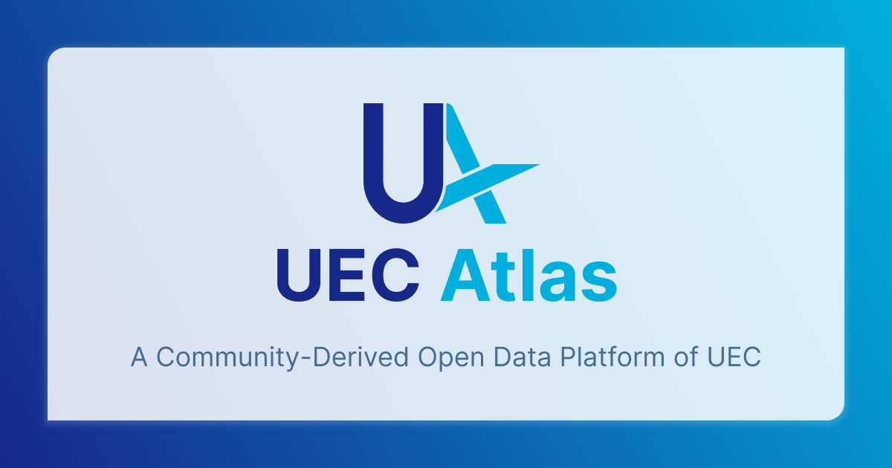

# UEC Atlas

  

UEC Atlasは、電気通信大学のデータを 構造化・整理し、誰もが利用できるようにする Linked Open Data プロジェクトです。

電気通信大学の学生は、大学生活を支える様々なアプリケーションを自身で開発・運用する文化がありますが、大学のデータは構造化されずに散在しているため、アプリケーション開発の障壁となっています。

本プロジェクトは、Linked Open Dataとして大学関連のデータを構造化・整理し、また自由にクエリできるSPARQLエンドポイントを提供することで、学生が大学のデータを活用したアプリケーションを開発しやすくすることを目指しています。

> [!WARNING]
> このプロジェクトは学生主体で運営されており、大学の公式なプロジェクトではありません。 情報の正確性や完全性は保証されないため、最新の情報や正式な情報が必要な場合は、大学の公式な情報源を参照してください。

## データの利用
データの利用に関する説明は、[Webサイト](https://uec-atlas.org/)を参照してください。

## 開発環境
開発環境の構築方法は、[CONTRIBUTING.md](CONTRIBUTING.md)を参照してください。
